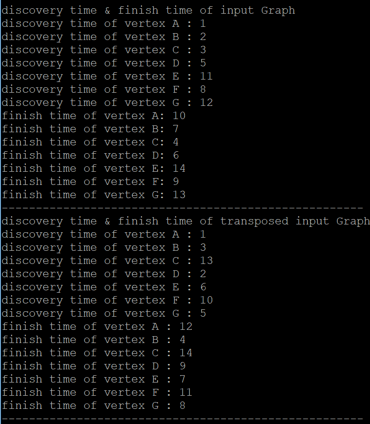

## Program For finding Strongly Connected Component ##

This repository is for 2018-1 Algorithm Analysis hw4
This repository provides Makefile to build program

-------------
### How to run ###

1. Simply command as below to make executable file of this program :  
<code> $ make </code>

2. Then command as below to run program :  
<code> $ ./SCC </code>

* *If you want to use different input file, you only need to modify input file name in scc.c file.*
* *If number of vertex in your input file is changed, you need to modify value of numOfVertex in scc.c file, which defined using #define.*

### Screen shots ###
1. First screesnshot shows Adjacency Matrix and Adjacency List of input graph(let's call it G)

2. Second screenshot shows discovery time and finish time of each node for both G and transpose of G

3. Last screenshot shows Strongly Connected Component founded.

